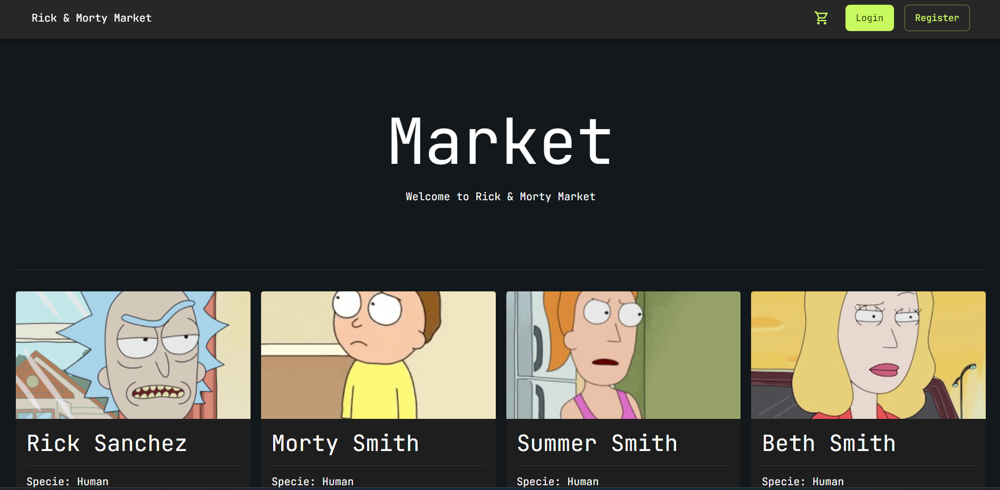
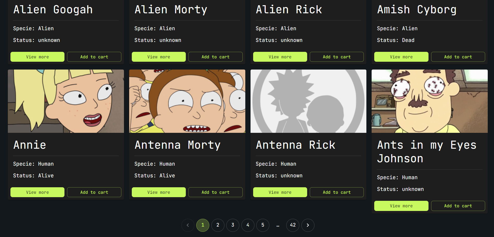
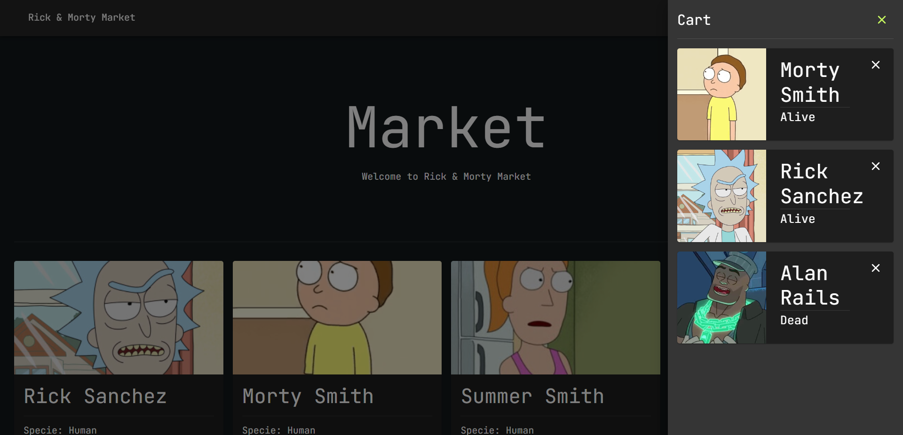
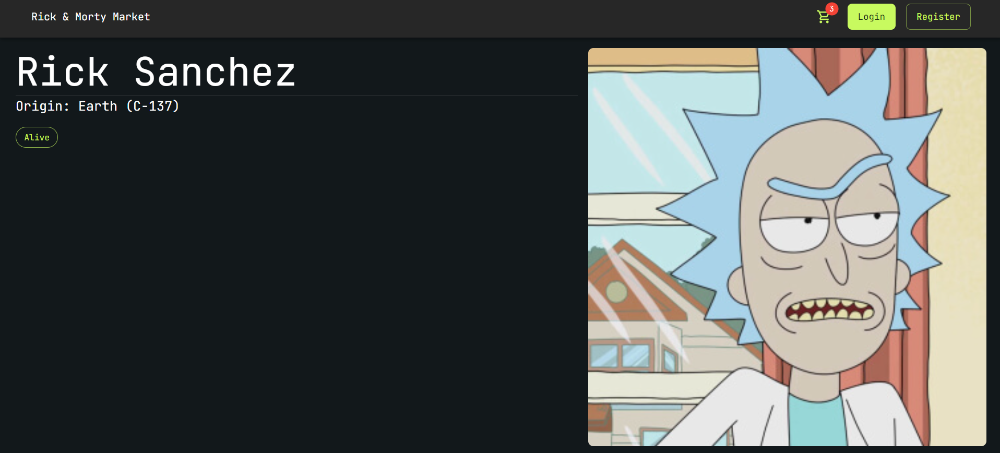
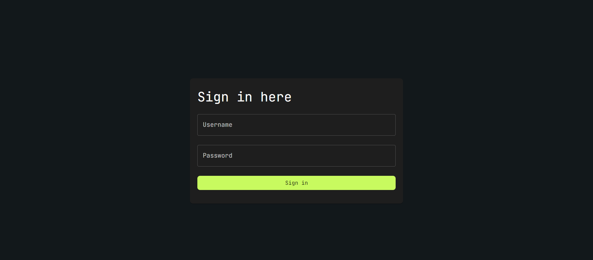

# Rick y Morty Marketplace

Este proyecto contiene una aplicación sencilla creada con React y Typescript, presenta un simple marketplace usando la API de Rick y Morty, en la aplicación se integran conceptos de React usando Typescript, integración y personalización de Material UI, formularios, redux, etc.

## Installation

Get code using

```
git clone https://github.com/baguilar6174/react-ts-marketplace-app.git
```

Step 2:

Install the necessary libraries (make sure you have node and yarn)

```
yarn
```

Step 3:

Runs the app in the development mode

```
yarn dev
```

Open [http://localhost:5173](http://localhost:5173) to view it in the browser.

## My process

### Built with

- Vite
- React JS 18
- Typescript
- Material UI
- React Router DOM
- Yup

## What I learned

- SPA (Single Page Application)
- Context
- Custom Hooks
- Customize and using MUI
- Create pagination
- Form validation using YUP
- Create a simple shopping cart using redux

## Rick y Morty Marketplace

<table>
  <tr>
    <td align="center" valign="center"></td>
    <td align="center" valign="center"></td>
  </tr>
  <tr>
    <td align="center" valign="center"></td>
    <td align="center" valign="center"></td>
  </tr>
  <tr>
    <td align="center" valign="center"></td>
  </tr>
 </table>

## Author

- Website - [www.bryan-aguilar.com](https://www.bryan-aguilar.com/)
- Medium - [baguilar6174](https://baguilar6174.medium.com/)
- LinkeIn - [baguilar6174](https://www.linkedin.com/in/baguilar6174)
- Email - [bryan.aguilar6174@gmail.com](mailto:bryan.aguilar6174@gmail.com)
